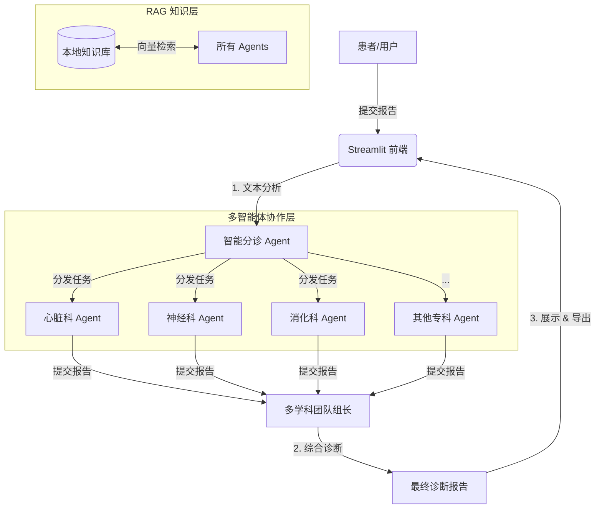

# 🏥 医疗诊断 AI 智能体 (Medical Diagnostics AI Agent)

[](https://share.streamlit.io/)
[](https://opensource.org/licenses/MIT)
[](https://www.python.org/downloads/)

> **注意**：本项目仅供研究与面试演示使用，严禁用于真实临床诊疗。

## 📖 项目简介

这是一个基于 **多智能体协作 (Multi-Agent Collaboration)** 和 **RAG (检索增强生成)** 技术的智能医疗诊断系统。系统模拟了现实医院的**多学科会诊 (MDT)** 流程：

1.  **智能分诊**：根据患者主诉，自动匹配最相关的专科医生。
2.  **专科分析**：**13位** 不同领域的专科 AI 智能体（心脏科、神经科、肿瘤科等）并行分析报告。
3.  **知识检索**：内置 RAG 引擎，自动从本地医学知识库中检索相关文献和指南。
4.  **综合诊断**：由“多学科团队组长”汇总各科室意见，给出最终诊断建议。

## ✨ 核心特性

*   **🧠 多模型支持**：
    *   **云端**：集成 Qwen (通义千问)、OpenAI (GPT-4)、Gemini。
    *   **本地**：支持 DeepSeek-R1 等开源模型（通过 HuggingFace）。
*   **🤝 13大专科智能体**：覆盖心脏、心理、肺、神经、内分泌、免疫、消化、皮肤、肿瘤、血液、肾脏、风湿等科室。
*   **📚 RAG 知识库**：支持本地 FAISS 向量库，实现离线知识检索，保护隐私。
*   **⚡ 流式响应**：采用 Streamlit 实现打字机效果的实时流式输出。
*   **💾 数据持久化**：内置 SQLite 数据库，自动保存问诊记录和结构化数据。
*   **📄 报告导出**：支持一键导出 PDF 和 Word 格式的正式诊断报告。

## 🏗️ 系统架构



## 🚀 快速开始

### 1. 克隆仓库
```bash
git clone https://github.com/MZCnyhhd/Medical-Diagnostics.git
cd Medical-Diagnostics
```

### 2. 安装依赖
```bash
pip install -r requirements.txt
```

### 3. 配置 API Key
复制 `apikey.env` 并填入您的 Key（推荐使用 Qwen 以获得最佳性价比）：
```env
LLM_PROVIDER=qwen
DASHSCOPE_API_KEY=sk-xxxxxxxx
```

### 4. 运行应用
```bash
streamlit run app.py
```

## 📂 目录结构

```
├── app.py                  # Streamlit Web 应用入口
├── config/                 # 配置文件
│   ├── apikey.env         # API密钥配置
│   └── prompts.yaml       # 提示词配置
├── data/                   # 数据目录
│   ├── knowledge_base/    # RAG 知识库文档
│   ├── medical_reports/   # 示例医疗报告
│   └── medical_diagnostics.db  # SQLite 数据库
├── src/                    # 源代码
│   ├── agents/            # 智能体实现
│   ├── core/              # 核心模块（编排、配置、分诊）
│   ├── services/          # 服务层（LLM、RAG、KG、缓存）
│   ├── scripts/           # 脚本工具
│   ├── tools/             # 工具函数
│   └── ui/                # UI 组件
└── requirements.txt        # 依赖列表
```

## 📜 许可证

本项目采用 [MIT License](LICENSE) 授权。
